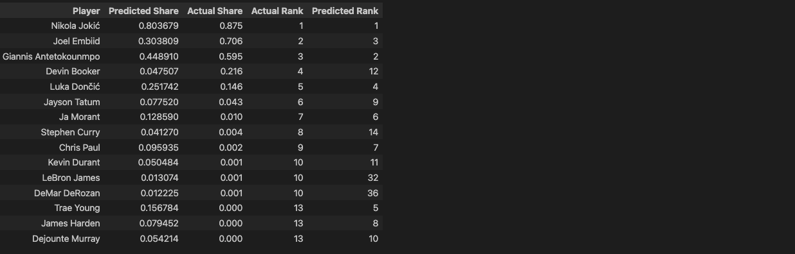

# 🏀 HoopProphet
**HoopProphet** is a Python app that uses machine learning to predict the NBA Most Valuable Player (MVP), using over 30 seasons of player, team, and MVP voting data and 800k+ data points. Sourcing data from [Basketball Reference](https://www.basketball-reference.com), this app scrapes, cleans, and merges large-scale NBA datasets, then trains regression models to estimate MVP voting shares—correctly identifying top contenders in the 2023 season.

## Prediction Results: 


## 📚 Table of Contents
- [⚙️ Technical Overview](#️-technical-overview)
- [🧠 Challenges Encountered](#-challenges-encountered)
- [🗂️ Project Structure](#️-project-structure)
- [🚀 Getting Started](#-getting-started)
  - [Prereqs](#prereqs)
  - [Installation](#installation)
  - [Running the project](#running-the-project)
- [🧪 Testing Overview](#testing-overview)
- [🛠️ Technologies & Resources Used](#technologies--resources-used)
  - [Languages & Libraries](#languages--libraries)
  - [Development Tools](#development-tools)
  - [Learning Resources](#learning-resources)
## ⚙️ Technical Overview
- Reverse-engineered the `BasketballReference`'s API to automate a web scraper using `BeautifulSoup` and `Selenium` 
- Preprocessed raw HTML data into structured tabular format using `pandas`. Performed missing value cleaning, feature scaling, and aggregation to create an analytical dataset.
- Trained and evaluated multiple supervised regression machine learning models to predict the NBA MVP voting share % of each player, examining various error metrics like MSE and  ranking accuracy.
- Tuned models via grid-search cross-validation and used dimensionality reduction (PCA, RFE) to reduce overfitting and improve generalization.
## 🧠 Challenges Encountered
This project presented a number of unique data analysis and data science challenges. Working with over 30 seasons of NBA data meant dealing with messy, inconsistent datasets, missing values, and edge cases like players being traded mid-season. Addressing these issues required creative feature engineering, rigorous data cleaning, and applying domain-specific heuristics about sports performance 
1. **Missing Values (ex. FG%, 3P%)** 
	- Missing values in shooting-based stats like `3PT%`, `FT%`, and `FG%` occurred in players who had zero shot attempts in those categories. In these cases, I used a domain-driven zero imputation approach of explicitly setting these features to `0%`, based on the assumption that players who never attempt a shot are likely not strong in that area. 
	- Since it's nearly impossible to win MVP without attempting shots or free throws, this heuristic supports the model’s goal of identifying realistic MVP candidates.
2. **Duplicate Player Entires (Mid-Season Trades**
	- Players traded mid-season appeared multiple times (once for each time that they were a member of)
	- This was an edge case that I had not considered when cleaning the data - in order to address this, if a player played for multiple teams in the same season, the cumulative individual performance data was used for player stats, and team W/L data of the players' most recent team was used for the player's team stats.
3. **Inconsistent Team Name Formats** 
	- There were several inconsistencies in the datasets even within the `basketball-reference` site, for instance some tables represented teams using abbreviations, (ex. `BOS`, `NYK`, etc.), while others used the full team name (ex. `Boston Celtics`, `New York Knicks`, etc.).
		- With tens of thousands of rows in some tables and the potential for human error, I relied on the aggregate functions of `Pandas` to query the dataset (selecting the columns, filtering the rows, etcl) in a way similar to `SQL` in order to ensure the data was cleaned and ready for machine learning.
	- To resolve this conflict, I normalized team identifiers to always use the full name (`Los Angeles Lakers` instead of  `LAL` ). I manually curated string mappings and applied these where necessary
4. **Unicode Player Name Conflicts**
	- For instance, when combining player statistics and team statistics, the CSV data contained separate data `Luka DonÄCiÄ` vs. `Luka Dončić`, due to inconsistencies in the raw data's name strings.
	- This was resolved by explicitly using `utf-8` encoding when downloading and parsing scraped HTML.
5. **Ethically Web Scraping**
	- Initially, I encountered various `HTTP` errors while sending requests to `BasketballReference`'s web servers, in particular `TooManyRedirects` and `TooManyRequests` status codes
	- To address this, I examined the site's `robots.txt` file to learn the policy on web scraping bots, and implemented crawler delays as well as exponential backoff to comply with them.
## 🗂️ Project Structure
This project uses a modular organization to separate out data collection, processing, and modeling
```
HoopProphet-MVP-Predictor/
│
├── notebooks
│   ├── 01_player_data-processor.ipynb    # scraping and downloading individual player stats
│   ├── 02_team_data_processor.ipynb    # scraping and downloading team W/L stats
│   ├── 03_mvp_data_processor.ipynb    # scraping and downloading mvp voting shares
│   ├── 04_data_cleaning.ipynb    # cleaning, pre-processing,and aggregating all our scraped data 
│   ├── 05_machine_learning.ipynb    # feature engineering, model training, model evaluation, and model selection
│   ├── nicknames.csv    # mapping of team abbreviations to the their team name
│   └── scraping_utils.py    # shared logic for HTTP response handling
├── prediction_results.png    # image displaying the prediction outcomes of our best model
├── README.md
├── requirements.txt    # python dependencies
├── setup_chromedriver.py    # test script for ensuring chrome browser bot is working properly

```

## 🚀 Getting Started
### Prereqs
- Python 3.8+ 
- Google Chrome browser (for Selenium)
	- The `setup_chromedriver.py` script will automatically download and install the compatible chrome driver server for the OS's chrome version
- Define your environment variables in `env`  
	- Rename `.env.template` to `.env`
	- Replace the placeholder environment variable values with your own env variable values
### Installation 
```bash
# Clone the repo and navigate to the project folder
git clone git@github.com:DunnyBunny1/HoopProphet.git
cd HoopProphet/

# Create a virutal environment
python -m venv venv

# Activate the venv
# On MacOS / Linux: 
source ./venv/bin/activate
# On Windows: 
.\venv\Scripts\Activate

# Install dependncies
pip install -r requirements.txt
```
### Running the project 
1. Setup the `ChromeDriver` server for your system 
```bash
python setup_chromedriver.py
```
- This will download a `ChromeDriver` compatible with your Google Chrome version if one isn't already installed yet. On success, it will open a Google Chrome browser window to `Google.com` for 4 seconds and then close it
2. To perform the web scraping and train the models, run each notebook in the `notebooks/` folder, in-order
	1. `01_player_data-processor.ipynb`
	2. `02_team_data_processor.ipynb`
	3. `03_mvp_data_processor.ipynb`
	4. `04_data_cleaning.ipynb`
	5. ...
3. You are now free to interact / modify the code as you wish! 
4. Feel free to open a Pull Request if you have an idea for improvement or find a bug 
## 🧪 Testing Overview
Testing was performed primarily through:
- **Jupyter notebook outputs** to inspect intermediate results and validate transformations 
- Pandas aggregation functions, (`isna()`, `dtypes()`, `groupby()`, `apply()`, etc.): 
	- Checking for and handling null / missing values
	- Summary statistics and outliers
	- Ensuring data is in the proper format 
- Burp Suite Proxy
	- API Reverse engineering: The `Proxy` and `Repeater` tools were helpful for intercepting outgoing HTTP requests, editing request headers / bodies, and inspecting results
	- Data integrity: The HTML renderer was used to view the raw data that was scraped to ensure integrity
## Technologies & Resources Used 
### Languages & Libraries
- `Python`, `pandas`, `scikit-learn`, `Selenium`, `BeautifulSoup`
### Development Tools
- `JupyterLab`, `VSCode`
- `Git`, `GitHub` for version control
### Learning Resources
- _Python Machine Learning_: Book by Raschka & Mirjalili
- `DataQuest` - YouTube - walked through how to interact with NBA datasets from basketball reference using the `pandas` library in Python